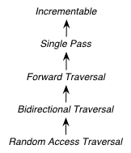
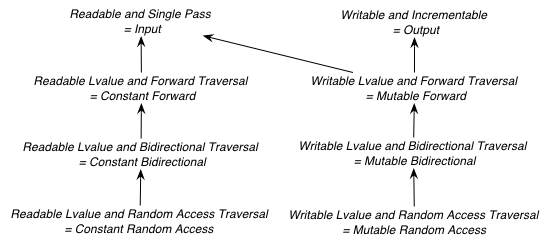

.. Distributed under the Boost
.. Software License, Version 1.0. (See accompanying
.. file LICENSE_1_0.txt or copy at http://www.boost.org/LICENSE_1_0.txt)

++++++++++++++++++++++
 New Iterator Concepts
++++++++++++++++++++++

.. Version 1.25 of this ReStructuredText document is the same as
   n1550_, the paper accepted by the LWG.

:Author: David Abrahams, Jeremy Siek, Thomas Witt
:Contact: dave@boost-consulting.com, jsiek@osl.iu.edu, witt@styleadvisor.com
:organization: `Boost Consulting`_, Indiana University `Open Systems
               Lab`_, `Zephyr Associates, Inc.`_
:date: $Date: 2007-11-25 10:38:02 -0800 (Sun, 25 Nov 2007) $

:Number: This is a revised version of n1550_\ =03-0133, which was
         accepted for Technical Report 1 by the C++ standard
         committee's library working group. This proposal is a
         revision of paper n1297_, n1477_, and n1531_.

:copyright: Copyright David Abrahams, Jeremy Siek, and Thomas Witt
         2003. 

.. _`Boost Consulting`: http://www.boost-consulting.com
.. _`Open Systems Lab`: http://www.osl.iu.edu
.. _`Zephyr Associates, Inc.`: http://www.styleadvisor.com

.. _`Institute for Transport Railway Operation and Construction`:
   http://www.ive.uni-hannover.de 

:Abstract: We propose a new system of iterator concepts that treat
           access and positioning independently. This allows the
           concepts to more closely match the requirements
           of algorithms and provides better categorizations
           of iterators that are used in practice. 
          
.. contents:: Table of Contents

.. _n1297: http://anubis.dkuug.dk/jtc1/sc22/wg21/docs/papers/2001/n1297.html
.. _n1477: http://anubis.dkuug.dk/jtc1/sc22/wg21/docs/papers/2003/n1477.html
.. _n1531: http://anubis.dkuug.dk/jtc1/sc22/wg21/docs/papers/2003/n1531.html
.. _n1550: http://anubis.dkuug.dk/jtc1/sc22/wg21/docs/papers/2003/n1550.html

============
 Motivation
============

The standard iterator categories and requirements are flawed because
they use a single hierarchy of concepts to address two orthogonal
issues: *iterator traversal* and *value access*. As a result, many
algorithms with requirements expressed in terms of the iterator
categories are too strict. Also, many real-world iterators can not be
accurately categorized.  A proxy-based iterator with random-access
traversal, for example, may only legally have a category of "input
iterator", so generic algorithms are unable to take advantage of its
random-access capabilities.  The current iterator concept hierarchy is
geared towards iterator traversal (hence the category names), while
requirements that address value access sneak in at various places. The
following table gives a summary of the current value access
requirements in the iterator categories.

+------------------------------------------------------------------------------+
|Value Access Requirements in Existing Iterator Categories                     |
+========================+=====================================================+
|Output Iterator         |``*i = a``                                           |
+------------------------+-----------------------------------------------------+
|Input Iterator          |``*i`` is convertible to ``T``                       |
+------------------------+-----------------------------------------------------+
|Forward Iterator        |``*i`` is ``T&`` (or ``const T&`` once `issue 200`_  |
|                        |is resolved)                                         |
+------------------------+-----------------------------------------------------+
|Random Access Iterator  |``i[n]`` is convertible to ``T`` (also ``i[n] = t``  |
|                        |is required for mutable iterators once `issue 299`_  |
|                        |is resolved)                                         |
+------------------------+-----------------------------------------------------+

.. _issue 200: http://anubis.dkuug.dk/JTC1/SC22/WG21/docs/lwg-active.html#200
.. _issue 299: http://anubis.dkuug.dk/JTC1/SC22/WG21/docs/lwg-active.html#299

Because iterator traversal and value access are mixed together in a
single hierarchy, many useful iterators can not be appropriately
categorized. For example, ``vector<bool>::iterator`` is almost a
random access iterator, but the return type is not ``bool&`` (see
`issue 96`_ and Herb Sutter's paper J16/99-0008 = WG21
N1185). Therefore, the iterators of ``vector<bool>`` only meet the
requirements of input iterator and output iterator.  This is so
nonintuitive that the C++ standard contradicts itself on this point.
In paragraph 23.2.4/1 it says that a ``vector`` is a sequence that
supports random access iterators.

.. _issue 96: http://anubis.dkuug.dk/JTC1/SC22/WG21/docs/lwg-active.html#96

Another difficult-to-categorize iterator is the transform iterator, an
adaptor which applies a unary function object to the dereferenced
value of the some underlying iterator (see `transform_iterator`_).
For unary functions such as ``times``, the return type of
``operator*`` clearly needs to be the ``result_type`` of the function
object, which is typically not a reference.  Because random access
iterators are required to return lvalues from ``operator*``, if you
wrap ``int*`` with a transform iterator, you do not get a random
access iterator as might be expected, but an input iterator.

.. _`transform_iterator`: http://www.boost.org/libs/utility/transform_iterator.htm

A third example is found in the vertex and edge iterators of the
`Boost Graph Library`_. These iterators return vertex and edge
descriptors, which are lightweight handles created on-the-fly. They
must be returned by-value. As a result, their current standard
iterator category is ``input_iterator_tag``, which means that,
strictly speaking, you could not use these iterators with algorithms
like ``min_element()``. As a temporary solution, the concept
`Multi-Pass Input Iterator`_ was introduced to describe the vertex and
edge descriptors, but as the design notes for the concept suggest, a
better solution is needed.

.. _Boost Graph Library: http://www.boost.org/libs/graph/doc/table_of_contents.html
.. _Multi-Pass Input Iterator: http://www.boost.org/libs/utility/MultiPassInputIterator.html

In short, there are many useful iterators that do not fit into the
current standard iterator categories. As a result, the following bad
things happen:

- Iterators are often mis-categorized. 

- Algorithm requirements are more strict than necessary, because they
  cannot separate the need for random access or bidirectional
  traversal from the need for a true reference return type.

========================
 Impact on the Standard
========================

This proposal for TR1 is a pure extension. Further, the new iterator
concepts are backward-compatible with the old iterator requirements,
and old iterators are forward-compatible with the new iterator
concepts. That is to say, iterators that satisfy the old requirements
also satisfy appropriate concepts in the new system, and iterators
modeling the new concepts will automatically satisfy the appropriate
old requirements.

.. I think we need to say something about the resolution to allow
   convertibility to any of the old-style tags as a TR issue (hope it
   made it). -DWA

.. Hmm, not sure I understand. Are you talking about whether a
   standards conforming input iterator is allowed to have
   a tag that is not input_iterator_tag but that
   is convertible to input_iterator_tag? -JGS

Possible (but not proposed) Changes to the Working Paper
========================================================

The extensions in this paper suggest several changes we might make
to the working paper for the next standard.  These changes are not
a formal part of this proposal for TR1.

Changes to Algorithm Requirements
+++++++++++++++++++++++++++++++++

The algorithms in the standard library could benefit from the new
iterator concepts because the new concepts provide a more accurate way
to express their type requirements. The result is algorithms that are
usable in more situations and have fewer type requirements.

For the next working paper (but not for TR1), the committee should
consider the following changes to the type requirements of algorithms.
These changes are phrased as textual substitutions, listing the
algorithms to which each textual substitution applies.

Forward Iterator -> Forward Traversal Iterator and Readable Iterator

  ``find_end, adjacent_find, search, search_n, rotate_copy,
  lower_bound, upper_bound, equal_range, binary_search,
  min_element, max_element``

Forward Iterator (1) -> Single Pass Iterator and Readable Iterator,
Forward Iterator (2) -> Forward Traversal Iterator and Readable Iterator

  ``find_first_of``

Forward Iterator -> Readable Iterator and Writable Iterator

  ``iter_swap``

Forward Iterator -> Single Pass Iterator and Writable Iterator

  ``fill, generate``

Forward Iterator -> Forward Traversal Iterator and Swappable Iterator

  ``rotate``

Forward Iterator (1) -> Swappable Iterator and Single Pass Iterator,
Forward Iterator (2) -> Swappable Iterator and  Incrementable Iterator

  ``swap_ranges``

Forward Iterator -> Forward Traversal Iterator and Readable Iterator and Writable Iterator
  ``remove, remove_if, unique``

Forward Iterator -> Single Pass Iterator and Readable Iterator and Writable Iterator

  ``replace, replace_if``

Bidirectional Iterator -> Bidirectional Traversal Iterator and Swappable Iterator
  ``reverse``

Bidirectional Iterator -> Bidirectional Traversal Iterator and Readable and Swappable Iterator
  ``partition``

Bidirectional Iterator (1) -> Bidirectional Traversal Iterator and Readable Iterator, 
Bidirectional Iterator (2) -> Bidirectional Traversal Iterator and Writable Iterator

  ``copy_backwards``

Bidirectional Iterator -> Bidirectional Traversal Iterator and Swappable Iterator and Readable Iterator
  ``next_permutation, prev_permutation``

Bidirectional Iterator -> Bidirectional Traversal Iterator and Readable Iterator and Writable Iterator
  ``stable_partition, inplace_merge``

Bidirectional Iterator -> Bidirectional Traversal Iterator and Readable Iterator
  ``reverse_copy``

Random Access Iterator -> Random Access Traversal Iterator and Readable and Writable Iterator
  ``random_shuffle, sort, stable_sort, partial_sort, nth_element, push_heap, pop_heap
  make_heap, sort_heap``

Input Iterator (2) -> Incrementable Iterator and Readable Iterator
  ``equal, mismatch``

Input Iterator (2) -> Incrementable Iterator and Readable Iterator
  ``transform``

Deprecations
++++++++++++

For the next working paper (but not for TR1), the committee should
consider deprecating the old iterator tags, and
std::iterator_traits, since it will be superceded by individual
traits metafunctions.

``vector<bool>``
++++++++++++++++

For the next working paper (but not for TR1), the committee should
consider reclassifying ``vector<bool>::iterator`` as a Random
Access Traversal Iterator and Readable Iterator and Writable
Iterator.

========
 Design
========

The iterator requirements are to be separated into two groups. One set
of concepts handles the syntax and semantics of value access:

- Readable Iterator
- Writable Iterator
- Swappable Iterator
- Lvalue Iterator

The access concepts describe requirements related to ``operator*`` and
``operator->``, including the ``value_type``, ``reference``, and
``pointer`` associated types.

The other set of concepts handles traversal:

- Incrementable Iterator
- Single Pass Iterator
- Forward Traversal Iterator
- Bidirectional Traversal Iterator
- Random Access Traversal Iterator

The refinement relationships for the traversal concepts are in the
following diagram.

In addition to the iterator movement operators, such as
``operator++``, the traversal concepts also include requirements on
position comparison such as ``operator==`` and ``operator<``.  The
reason for the fine grain slicing of the concepts into the
Incrementable and Single Pass is to provide concepts that are exact
matches with the original input and output iterator requirements.

This proposal also includes a concept for specifying when an iterator
is interoperable with another iterator, in the sense that ``int*`` is
interoperable with ``int const*``.

- Interoperable Iterators

The relationship between the new iterator concepts and the old are
given in the following diagram.

Like the old iterator requirements, we provide tags for purposes of
dispatching based on the traversal concepts.  The tags are related via
inheritance so that a tag is convertible to another tag if the concept
associated with the first tag is a refinement of the second tag.

Our design reuses ``iterator_traits<Iter>::iterator_category`` to
indicate an iterator's traversal capability.  To specify
capabilities not captured by any old-style iterator category, an
iterator designer can use an ``iterator_category`` type that is
convertible to both the the most-derived old iterator category tag
which fits, and the appropriate new iterator traversal tag.

.. dwa2003/1/2: Note that we are not *requiring* convertibility to
   a new-style traversal tag in order to meet new concepts.
   Old-style iterators still fit, after all.

We do not provide tags for the purposes of dispatching based on the
access concepts, in part because we could not find a way to
automatically infer the right access tags for old-style iterators.
An iterator's writability may be dependent on the assignability of
its ``value_type`` and there's no known way to detect whether an
arbitrary type is assignable.  Fortunately, the need for
dispatching based on access capability is not as great as the need
for dispatching based on traversal capability.

A difficult design decision concerned the ``operator[]``. The direct
approach for specifying ``operator[]`` would have a return type of
``reference``; the same as ``operator*``. However, going in this
direction would mean that an iterator satisfying the old Random Access
Iterator requirements would not necessarily be a model of Readable or
Writable Lvalue Iterator.  Instead we have chosen a design that
matches the preferred resolution of `issue 299`_: ``operator[]`` is
only required to return something convertible to the ``value_type``
(for a Readable Iterator), and is required to support assignment
``i[n] = t`` (for a Writable Iterator).

===============
 Proposed Text
===============

Addition to [lib.iterator.requirements]
=======================================

Iterator Value Access Concepts [lib.iterator.value.access]
++++++++++++++++++++++++++++++++++++++++++++++++++++++++++

In the tables below, ``X`` is an iterator type, ``a`` is a constant
object of type ``X``, ``R`` is
``std::iterator_traits<X>::reference``, ``T`` is
``std::iterator_traits<X>::value_type``, and ``v`` is a constant
object of type ``T``.

.. _Readable Iterator:

Readable Iterators [lib.readable.iterators]
-------------------------------------------

A class or built-in type ``X`` models the *Readable Iterator* concept
for value type ``T`` if, in addition to ``X`` being Assignable and
Copy Constructible, the following expressions are valid and respect
the stated semantics. ``U`` is the type of any specified member of
type ``T``.

+-----------------------------------------------------------------------------------------------------------------------------+
|Readable Iterator Requirements (in addition to Assignable and Copy Constructible)                                            |
+-----------------------------------+------------------------+----------------------------------------------------------------+
|Expression                         |Return Type             |Note/Precondition                                               |
+===================================+========================+================================================================+
|``iterator_traits<X>::value_type`` |``T``                   |Any non-reference,                                              |
|                                   |                        |non-cv-qualified type                                           |
+-----------------------------------+------------------------+----------------------------------------------------------------+
|``*a``                             | Convertible to ``T``   |pre: ``a`` is dereferenceable. If ``a == b`` then ``*a``        |
|                                   |                        | is equivalent to ``*b``.                                       |
+-----------------------------------+------------------------+----------------------------------------------------------------+
|``a->m``                           |``U&``                  |pre: ``pre: (*a).m`` is well-defined. Equivalent to ``(*a).m``. |
+-----------------------------------+------------------------+----------------------------------------------------------------+

.. We won't say anything about iterator_traits<X>::reference until the DR is resolved. -JGS

.. _Writable Iterator:

Writable Iterators [lib.writable.iterators]
-------------------------------------------

A class or built-in type ``X`` models the *Writable Iterator* concept
if, in addition to ``X`` being Copy Constructible, the following
expressions are valid and respect the stated semantics.  Writable
Iterators have an associated *set of value types*.

+---------------------------------------------------------------------+
|Writable Iterator Requirements (in addition to Copy Constructible)   |
+-------------------------+--------------+----------------------------+
|Expression               |Return Type   |Precondition                |
+=========================+==============+============================+
|``*a = o``               |              | pre: The type of ``o``     |
|                         |              | is in the set of           |
|                         |              | value types of ``X``       |
+-------------------------+--------------+----------------------------+

Swappable Iterators [lib.swappable.iterators]
---------------------------------------------

A class or built-in type ``X`` models the *Swappable Iterator* concept
if, in addition to ``X`` being Copy Constructible, the following
expressions are valid and respect the stated semantics.

+---------------------------------------------------------------------+
|Swappable Iterator Requirements (in addition to Copy Constructible)  |
+-------------------------+-------------+-----------------------------+
|Expression               |Return Type  |Postcondition                |
+=========================+=============+=============================+
|``iter_swap(a, b)``      |``void``     |the pointed to values are    |
|                         |             |exchanged                    |
+-------------------------+-------------+-----------------------------+

[*Note:* An iterator that is a model of the `Readable Iterator`_ and
`Writable Iterator`_ concepts is also a model of *Swappable
Iterator*.  *--end note*]

Lvalue Iterators [lib.lvalue.iterators]
---------------------------------------

The *Lvalue Iterator* concept adds the requirement that the return
type of ``operator*`` type be a reference to the value type of the
iterator.  

+-------------------------------------------------------------+
| Lvalue Iterator Requirements                                |
+-------------+-----------+-----------------------------------+
|Expression   |Return Type|Note/Assertion                     |
+=============+===========+===================================+
|``*a``       | ``T&``    |``T`` is *cv*                      |
|             |           |``iterator_traits<X>::value_type`` |
|             |           |where *cv* is an optional          |
|             |           |cv-qualification.  pre: ``a`` is   |
|             |           |dereferenceable.                   |
+-------------+-----------+-----------------------------------+

If ``X`` is a `Writable Iterator`_ then ``a == b`` if and only if
``*a`` is the same object as ``*b``.  If ``X`` is a `Readable
Iterator`_ then ``a == b`` implies ``*a`` is the same object as
``*b``.

Iterator Traversal Concepts [lib.iterator.traversal]
++++++++++++++++++++++++++++++++++++++++++++++++++++

In the tables below, ``X`` is an iterator type, ``a`` and ``b`` are
constant objects of type ``X``, ``r`` and ``s`` are mutable objects of
type ``X``, ``T`` is ``std::iterator_traits<X>::value_type``, and
``v`` is a constant object of type ``T``.

Incrementable Iterators [lib.incrementable.iterators]
-----------------------------------------------------

A class or built-in type ``X`` models the *Incrementable Iterator*
concept if, in addition to ``X`` being Assignable and Copy
Constructible, the following expressions are valid and respect the
stated semantics.

+------------------------------------------------------------------------------------+
|Incrementable Iterator Requirements (in addition to Assignable, Copy Constructible) |
|                                                                                    |
+--------------------------------+-------------------------------+-------------------+
|Expression                      |Return Type                    |Assertion          |
+================================+===============================+===================+
|``++r``                         |``X&``                         |``&r == &++r``     |
+--------------------------------+-------------------------------+-------------------+
|``r++``                         |                               |                   |
+--------------------------------+-------------------------------+-------------------+
|``*r++``                        |                               |                   |
+--------------------------------+-------------------------------+-------------------+
|``iterator_traversal<X>::type`` |Convertible to                 |                   |
|                                |``incrementable_traversal_tag``|                   |
+--------------------------------+-------------------------------+-------------------+

If ``X`` is a `Writable Iterator`_ then ``X a(r++);`` is equivalent
to ``X a(r); ++r;`` and ``*r++ = o`` is equivalent
to  ``*r = o; ++r``.
If ``X`` is a `Readable Iterator`_ then ``T z(*r++);`` is equivalent
to ``T z(*r); ++r;``. 

.. TR1: incrementable_iterator_tag changed to
   incrementable_traversal_tag for consistency.

Single Pass Iterators [lib.single.pass.iterators]
-------------------------------------------------

A class or built-in type ``X`` models the *Single Pass Iterator*
concept if the following expressions are valid and respect the stated
semantics.

+----------------------------------------------------------------------------------------------------------------+
|Single Pass Iterator Requirements (in addition to Incrementable Iterator and Equality Comparable)               |
|                                                                                                                |
+----------------------------------------+-----------------------------+-------------+---------------------------+
|Expression                              |Return Type                  | Operational |Assertion/                 | 
|                                        |                             | Semantics   |Pre-/Post-condition        |
+========================================+=============================+=============+===========================+
|``++r``                                 |``X&``                       |             |pre: ``r`` is              |
|                                        |                             |             |dereferenceable; post:     |
|                                        |                             |             |``r`` is dereferenceable or|
|                                        |                             |             |``r`` is past-the-end      |
+----------------------------------------+-----------------------------+-------------+---------------------------+
|``a == b``                              |convertible to ``bool``      |             |``==`` is an equivalence   |
|                                        |                             |             |relation over its domain   |
+----------------------------------------+-----------------------------+-------------+---------------------------+
|``a != b``                              |convertible to ``bool``      |``!(a == b)``|                           |
+----------------------------------------+-----------------------------+-------------+---------------------------+
|``iterator_traits<X>::difference_type`` |A signed integral type       |             |                           |
|                                        |representing the distance    |             |                           |
|                                        |between iterators            |             |                           |
+----------------------------------------+-----------------------------+-------------+---------------------------+
|``iterator_traversal<X>::type``         |Convertible to               |             |                           |
|                                        |``single_pass_traversal_tag``|             |                           |
+----------------------------------------+-----------------------------+-------------+---------------------------+

.. TR1: single_pass_iterator_tag changed to
   single_pass_traversal_tag for consistency

Forward Traversal Iterators [lib.forward.traversal.iterators]
-------------------------------------------------------------

A class or built-in type ``X`` models the *Forward Traversal Iterator*
concept if, in addition to ``X`` meeting the requirements of Default
Constructible and Single Pass Iterator, the following expressions are
valid and respect the stated semantics. 

+--------------------------------------------------------------------------------------------------------+
|Forward Traversal Iterator Requirements (in addition to Default Constructible and Single Pass Iterator) |
+---------------------------------------+-----------------------------------+----------------------------+
|Expression                             |Return Type                        |Assertion/Note              |
+=======================================+===================================+============================+
|``X u;``                               |``X&``                             |note: ``u`` may have a      |
|                                       |                                   |singular value.             |
+---------------------------------------+-----------------------------------+----------------------------+
|``++r``                                |``X&``                             |``r == s`` and ``r`` is     |
|                                       |                                   |dereferenceable implies     |
|                                       |                                   |``++r == ++s.``             |
+---------------------------------------+-----------------------------------+----------------------------+
|``iterator_traversal<X>::type``        |Convertible to                     |                            |
|                                       |``forward_traversal_tag``          |                            |
+---------------------------------------+-----------------------------------+----------------------------+

.. TR1: forward_traversal_iterator_tag changed to
   forward_traversal_tag for consistency

Bidirectional Traversal Iterators [lib.bidirectional.traversal.iterators]
-------------------------------------------------------------------------

A class or built-in type ``X`` models the *Bidirectional Traversal
Iterator* concept if, in addition to ``X`` meeting the requirements of
Forward Traversal Iterator, the following expressions are valid and
respect the stated semantics.

+-----------------------------------------------------------------------------------------------------+
|Bidirectional Traversal Iterator Requirements (in addition to Forward Traversal                      |
|Iterator)                                                                                            |
+--------------------------------+-------------------------------+--------------+---------------------+
|Expression                      |Return Type                    |  Operational |Assertion/           |
|                                |                               |  Semantics   |Pre-/Post-condition  |
+================================+===============================+==============+=====================+
|``--r``                         |``X&``                         |              |pre: there exists    |
|                                |                               |              |``s`` such that ``r  |
|                                |                               |              |== ++s``.  post:     |
|                                |                               |              |``s`` is             |
|                                |                               |              |dereferenceable.     |
|                                |                               |              |                     |
|                                |                               |              |``++(--r) == r``.    |
|                                |                               |              |``--r == --s``       |
|                                |                               |              |implies ``r ==       |
|                                |                               |              |s``. ``&r == &--r``. |
+--------------------------------+-------------------------------+--------------+---------------------+
|``r--``                         |convertible to ``const X&``    |::            |                     |
|                                |                               |              |                     |
|                                |                               | {            |                     |
|                                |                               |   X tmp = r; |                     |
|                                |                               |   --r;       |                     |
|                                |                               |   return tmp;|                     |
|                                |                               | }            |                     |
+--------------------------------+-------------------------------+--------------+---------------------+
|``iterator_traversal<X>::type`` |Convertible to                 |              |                     |
|                                |``bidirectional_traversal_tag``|              |                     |
|                                |                               |              |                     |
+--------------------------------+-------------------------------+--------------+---------------------+

.. TR1: bidirectional_traversal_iterator_tag changed to
   bidirectional_traversal_tag for consistency

Random Access Traversal Iterators [lib.random.access.traversal.iterators]
-------------------------------------------------------------------------

A class or built-in type ``X`` models the *Random Access Traversal
Iterator* concept if the following expressions are valid and respect
the stated semantics.  In the table below, ``Distance`` is
``iterator_traits<X>::difference_type`` and ``n`` represents a
constant object of type ``Distance``.

+------------------------------------------------------------------------------------------------------------------+
|Random Access Traversal Iterator Requirements (in addition to Bidirectional Traversal Iterator)                   |
+-------------------------------+---------------------------------+-------------------------+----------------------+
|Expression                     |Return Type                      |Operational Semantics    |Assertion/            |
|                               |                                 |                         |Precondition          |
+===============================+=================================+=========================+======================+
|``r += n``                     |``X&``                           |::                       |                      |
|                               |                                 |                         |                      |
|                               |                                 | {                       |                      |
|                               |                                 |   Distance m = n;       |                      |
|                               |                                 |   if (m >= 0)           |                      |
|                               |                                 |     while (m--)         |                      |
|                               |                                 |       ++r;              |                      |
|                               |                                 |   else                  |                      |
|                               |                                 |     while (m++)         |                      |
|                               |                                 |       --r;              |                      |
|                               |                                 |   return r;             |                      |
|                               |                                 | }                       |                      |
+-------------------------------+---------------------------------+-------------------------+----------------------+
|``a + n``, ``n + a``           |``X``                            |``{ X tmp = a; return tmp|                      |
|                               |                                 |+= n; }``                |                      |
|                               |                                 |                         |                      |
+-------------------------------+---------------------------------+-------------------------+----------------------+
|``r -= n``                     |``X&``                           |``return r += -n``       |                      |
+-------------------------------+---------------------------------+-------------------------+----------------------+
|``a - n``                      |``X``                            |``{ X tmp = a; return tmp|                      |
|                               |                                 |-= n; }``                |                      |
|                               |                                 |                         |                      |
+-------------------------------+---------------------------------+-------------------------+----------------------+
|``b - a``                      |``Distance``                     |``a < b ?  distance(a,b) |pre: there exists a   |
|                               |                                 |: -distance(b,a)``       |value ``n`` of        |
|                               |                                 |                         |``Distance`` such that|
|                               |                                 |                         |``a + n == b``.  ``b  |
|                               |                                 |                         |== a + (b - a)``.     |
+-------------------------------+---------------------------------+-------------------------+----------------------+
|``a[n]``                       |convertible to T                 |``*(a + n)``             |pre: a is a `Readable |
|                               |                                 |                         |Iterator`_            |
+-------------------------------+---------------------------------+-------------------------+----------------------+
|``a[n] = v``                   |convertible to T                 |``*(a + n) = v``         |pre: a is a `Writable |
|                               |                                 |                         |Iterator`_            |
+-------------------------------+---------------------------------+-------------------------+----------------------+
|``a < b``                      |convertible to ``bool``          |``b - a > 0``            |``<`` is a total      |
|                               |                                 |                         |ordering relation     |
+-------------------------------+---------------------------------+-------------------------+----------------------+
|``a > b``                      |convertible to ``bool``          |``b < a``                |``>`` is a total      |
|                               |                                 |                         |ordering relation     |
+-------------------------------+---------------------------------+-------------------------+----------------------+
|``a >= b``                     |convertible to ``bool``          |``!(a < b)``             |                      |
+-------------------------------+---------------------------------+-------------------------+----------------------+
|``a <= b``                     |convertible to ``bool``          |``!(a > b)``             |                      |
+-------------------------------+---------------------------------+-------------------------+----------------------+
|``iterator_traversal<X>::type``|Convertible to                   |                         |                      |
|                               |``random_access_traversal_tag``  |                         |                      |
+-------------------------------+---------------------------------+-------------------------+----------------------+

.. TR1: random_access_traversal_iterator_tag changed to
   random_access_traversal_tag for consistency

Interoperable Iterators [lib.interoperable.iterators]
-----------------------------------------------------

A class or built-in type ``X`` that models Single Pass Iterator is
*interoperable with* a class or built-in type ``Y`` that also models
Single Pass Iterator if the following expressions are valid and
respect the stated semantics. In the tables below, ``x`` is an object
of type ``X``, ``y`` is an object of type ``Y``, ``Distance`` is
``iterator_traits<Y>::difference_type``, and ``n`` represents a
constant object of type ``Distance``.

+-----------+-----------------------+---------------------------------------------------+
|Expression |Return Type            |Assertion/Precondition/Postcondition               |
+===========+=======================+===================================================+
|``y = x``  |``Y``                  |post: ``y == x``                                   |
+-----------+-----------------------+---------------------------------------------------+
|``Y(x)``   |``Y``                  |post: ``Y(x) == x``                                |
+-----------+-----------------------+---------------------------------------------------+
|``x == y`` |convertible to ``bool``|``==`` is an equivalence relation over its domain. |
+-----------+-----------------------+---------------------------------------------------+
|``y == x`` |convertible to ``bool``|``==`` is an equivalence relation over its domain. |
+-----------+-----------------------+---------------------------------------------------+
|``x != y`` |convertible to ``bool``|``bool(a==b) != bool(a!=b)`` over its domain.      |
+-----------+-----------------------+---------------------------------------------------+
|``y != x`` |convertible to ``bool``|``bool(a==b) != bool(a!=b)`` over its domain.      |
+-----------+-----------------------+---------------------------------------------------+

If ``X`` and ``Y`` both model Random Access Traversal Iterator then
the following additional requirements must be met.

+-----------+-----------------------+---------------------+--------------------------------------+
|Expression |Return Type            |Operational Semantics|Assertion/ Precondition               |
+===========+=======================+=====================+======================================+
|``x < y``  |convertible to ``bool``|``y - x > 0``        |``<`` is a total ordering relation    |
+-----------+-----------------------+---------------------+--------------------------------------+
|``y < x``  |convertible to ``bool``|``x - y > 0``        |``<`` is a total ordering relation    |
+-----------+-----------------------+---------------------+--------------------------------------+
|``x > y``  |convertible to ``bool``|``y < x``            |``>`` is a total ordering relation    |
+-----------+-----------------------+---------------------+--------------------------------------+
|``y > x``  |convertible to ``bool``|``x < y``            |``>`` is a total ordering relation    |
+-----------+-----------------------+---------------------+--------------------------------------+
|``x >= y`` |convertible to ``bool``|``!(x < y)``         |                                      |
+-----------+-----------------------+---------------------+--------------------------------------+
|``y >= x`` |convertible to ``bool``|``!(y < x)``         |                                      |
+-----------+-----------------------+---------------------+--------------------------------------+
|``x <= y`` |convertible to ``bool``|``!(x > y)``         |                                      |
+-----------+-----------------------+---------------------+--------------------------------------+
|``y <= x`` |convertible to ``bool``|``!(y > x)``         |                                      |
+-----------+-----------------------+---------------------+--------------------------------------+
|``y - x``  |``Distance``           |``distance(Y(x),y)`` |pre: there exists a value ``n`` of    |
|           |                       |                     |``Distance`` such that ``x + n == y``.|
|           |                       |                     |``y == x + (y - x)``.                 |
+-----------+-----------------------+---------------------+--------------------------------------+ 
|``x - y``  |``Distance``           |``distance(y,Y(x))`` |pre: there exists a value ``n`` of    |
|           |                       |                     |``Distance`` such that ``y + n == x``.|
|           |                       |                     |``x == y + (x - y)``.                 |
+-----------+-----------------------+---------------------+--------------------------------------+

Addition to [lib.iterator.synopsis]
===================================

::

  // lib.iterator.traits, traits and tags
  template <class Iterator> struct is_readable_iterator;
  template <class Iterator> struct iterator_traversal;

  struct incrementable_traversal_tag { };
  struct single_pass_traversal_tag : incrementable_traversal_tag { };
  struct forward_traversal_tag : single_pass_traversal_tag { };
  struct bidirectional_traversal_tag : forward_traversal_tag { };
  struct random_access_traversal_tag : bidirectional_traversal_tag { };

Addition to [lib.iterator.traits]
=================================

The ``is_readable_iterator`` class
template satisfies the UnaryTypeTrait_ requirements.  

Given an iterator type ``X``, ``is_readable_iterator<X>::value``
yields ``true`` if, for an object ``a`` of type ``X``, ``*a`` is
convertible to ``iterator_traits<X>::value_type``, and ``false``
otherwise.

``iterator_traversal<X>::type`` is 

.. parsed-literal::

  *category-to-traversal*\ (iterator_traits<X>::iterator_category) 

where *category-to-traversal* is defined as follows

.. _`category-to-traversal`:

.. parsed-literal::

   *category-to-traversal*\ (C) =
       if (C is convertible to incrementable_traversal_tag)
           return C;
       else if (C is convertible to random_access_iterator_tag)
           return random_access_traversal_tag;
       else if (C is convertible to bidirectional_iterator_tag)
           return bidirectional_traversal_tag;
       else if (C is convertible to forward_iterator_tag)
           return forward_traversal_tag;
       else if (C is convertible to input_iterator_tag)
           return single_pass_traversal_tag;
       else if (C is convertible to output_iterator_tag)
           return incrementable_traversal_tag;
       else
           *the program is ill-formed*

===========
 Footnotes
===========

.. _UnaryTypeTrait: n1519_

The UnaryTypeTrait concept is defined in n1519_; the LWG is
considering adding the requirement that specializations are derived
from their nested ``::type``.

.. _n1519: http://anubis.dkuug.dk/jtc1/sc22/wg21/docs/papers/2003/n1519.htm

..
 LocalWords:  Abrahams Siek Witt const bool Sutter's WG int UL LI href Lvalue
 LocalWords:  ReadableIterator WritableIterator SwappableIterator cv pre iter
 LocalWords:  ConstantLvalueIterator MutableLvalueIterator CopyConstructible TR
 LocalWords:  ForwardTraversalIterator BidirectionalTraversalIterator lvalue
 LocalWords:  RandomAccessTraversalIterator dereferenceable Incrementable tmp
 LocalWords:  incrementable xxx min prev inplace png oldeqnew AccessTag struct
 LocalWords:  TraversalTag typename lvalues DWA Hmm JGS mis enum
